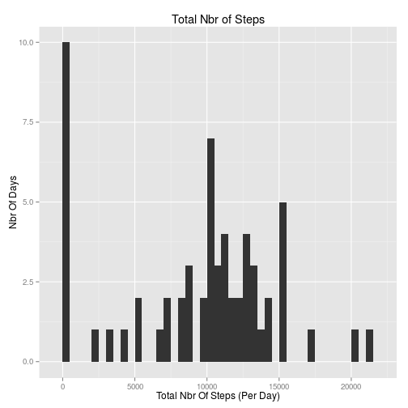
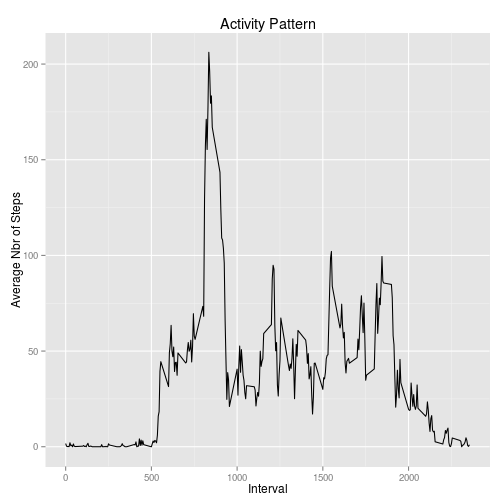
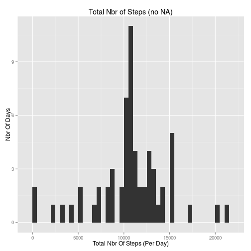
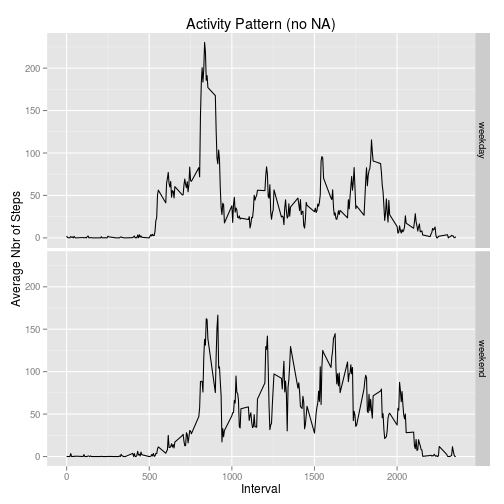

Repro research, Assignment 1
============================

## Setting global options

Setting echo=TRUE for all code chunks.


```r
rm(list=ls())
library(knitr)
opts_chunk$set(echo = TRUE)
```

## Loading and processing data

Loading the libraries and the data. Then transform the dates.


```r
library(ggplot2)
unzip("activity.zip") # create activity.csv
Data = read.csv("activity.csv", as.is=T)
Data$date = as.Date(Data$date) # transfo dates
```

## Total number of steps per day

Calculate the total number of steps per day and plot the histogram.


```r
TotalStepPerDay = with(Data, tapply(steps, date, sum, na.rm=T))
histStepPerDay = qplot(TotalStepPerDay, binwidth=500) + xlab("Total Nbr Of Steps (Per Day)") + ylab("Nbr Of Days") + ggtitle("Total Nbr of Steps")
print(histStepPerDay)
```

 

Calculate the mean and median across all days.


```r
meanTotalStepPerDay = mean(TotalStepPerDay)
medianTotalStepPerDay = median(TotalStepPerDay)
```

The mean is 9354.23 and the median is 10395.

## Daily activity pattern

Average the number of steps per interval and plot the time series.


```r
MeanStepPerInterval = with(Data, tapply(steps, interval, mean, na.rm=T))
UniqInterval = unique(Data$interval)
qplot(UniqInterval, MeanStepPerInterval, geom="line") + xlab("Interval") + ylab("Average Nbr of Steps") + ggtitle("Activity Pattern")
```

 

Get the interval with the maximum number of steps.


```r
maxNbrStep = names(which(MeanStepPerInterval == max(MeanStepPerInterval))) # interval 835
```

The interval where the maximum number of steps is observed is 835.

## Imputing missing values

Create a local function to get the mean for a given interval.


```r
getMean.fct = function(interval) { # interval should be a string
    res = MeanStepPerInterval[interval]
    return(as.numeric(res))
}
```

Count the number of missing values and create a new data frame with no missing values. The strategy for the imputation is to replace NAs by the average number of steps (accross all days) caclulated for the corresponding interval.


```r
IdxMissing = which(is.na(Data$steps))
nbrMissing = length(IdxMissing)
IntervalMissing = as.character(Data$interval[IdxMissing])
ImputedValue = sapply(IntervalMissing, getMean.fct)
Data2 = Data
Data2$steps[IdxMissing] = ImputedValue
```

The total number of missing values is 2304.

Plot the histogram based on the data with no missing value.


```r
TotalStepPerDay2 = with(Data2, tapply(steps, date, sum))
histStepPerDay2 = qplot(TotalStepPerDay2, binwidth=500) + xlab("Total Nbr Of Steps (Per Day)") + ylab("Nbr Of Days") + ggtitle("Total Nbr of Steps (no NA)")
print(histStepPerDay2)
```

 

Comparing the histograms shows that the mode of the distribution moved from the left side to the center after imputing the missing values.

Compute the mean and median after imputing the missing value.


```r
meanTotalStepPerDay2 = mean(TotalStepPerDay2)
medianTotalStepPerDay2 = median(TotalStepPerDay2)
```

After imputation, the mean is 10766.19 and the median is 10766.19.

Comparing the mean and median with or without missing values.


```r
meanTotalStepPerDay; meanTotalStepPerDay2 # MEAN with and without NA
```

```
## [1] 9354.23
```

```
## [1] 10766.19
```

```r
medianTotalStepPerDay; medianTotalStepPerDay2 # MEDIAN with and without NA
```

```
## [1] 10395
```

```
## [1] 10766.19
```

The mean and median are higher after imputing the missing values.

## Difference between weekdays and weekends

Create a factor for the type of day.


```r
NameDay = weekdays(Data2$date)
IsWeekend = NameDay == "Saturday" | NameDay == "Sunday"
TypeDay = factor(IsWeekend, labels=c("weekday", "weekend"))
Data3 = Data2
Data3$TypeDay = TypeDay
```

Plot the average number of steps for weekdays and weekends.


```r
MeanData = as.data.frame(with(Data3, tapply(steps, list(interval, TypeDay), mean)))
Interval = as.numeric(row.names(MeanData))
MeanDataStack = stack(MeanData)
MeanDataStack$Interval = Interval
names(MeanDataStack) = c("Step", "TypeDay", "Interval")
qplot(Interval, Step, geom = "line", facets = TypeDay~., data=MeanDataStack) + xlab("Interval") + ylab("Average Nbr of Steps") + ggtitle("Activity Pattern (no NA)")
```

 


